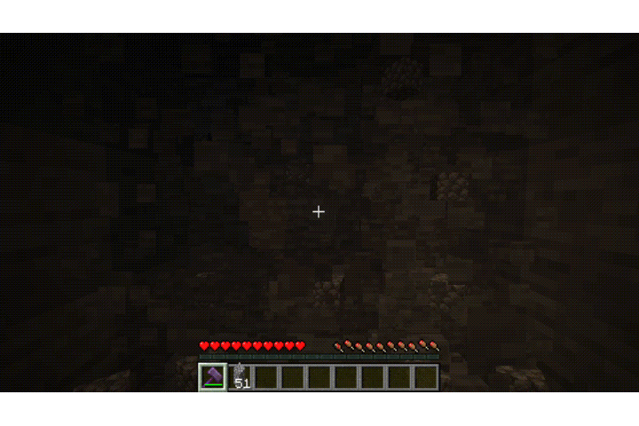
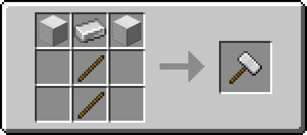

***Fabric also requires [Fabric API](https://modrinth.com/mod/fabric-api) and [Forge Config API Port](https://modrinth.com/mod/forge-config-api-port)!***

---

## About 📖

Hammering is a both Fabric and NeoForge mod and the successor to Hammered.

If you don't know Hammered, this mod basically adds hammers, that's it.

To be more specific:
- Iron Hammer
- Gold Hammer
- Diamond Hammer
- Netherite Hammer
- Hammering Enchantment

These hammers act like multi-tools (that means they're pickaxes, shovel, hoes and axes combined!)
which can mine up to a 3x3x3 area with enchantments!

## Showcase 🖼️

### Hammering 📕

Hammering is an enchantment that can be put on hammers, it mine a 3x3 area and with each level the depth
increases.

Hammering has 3 levels, means on level 3 it mines a 3x3x3 area.

**The enchantment can be disabled by sneaking**

### Recipes 🔨

## Other 📚

Found an issue or do you have feedback? Make an issue on the [issue tracker](https://github.com/Command17/Hammering/issues)!